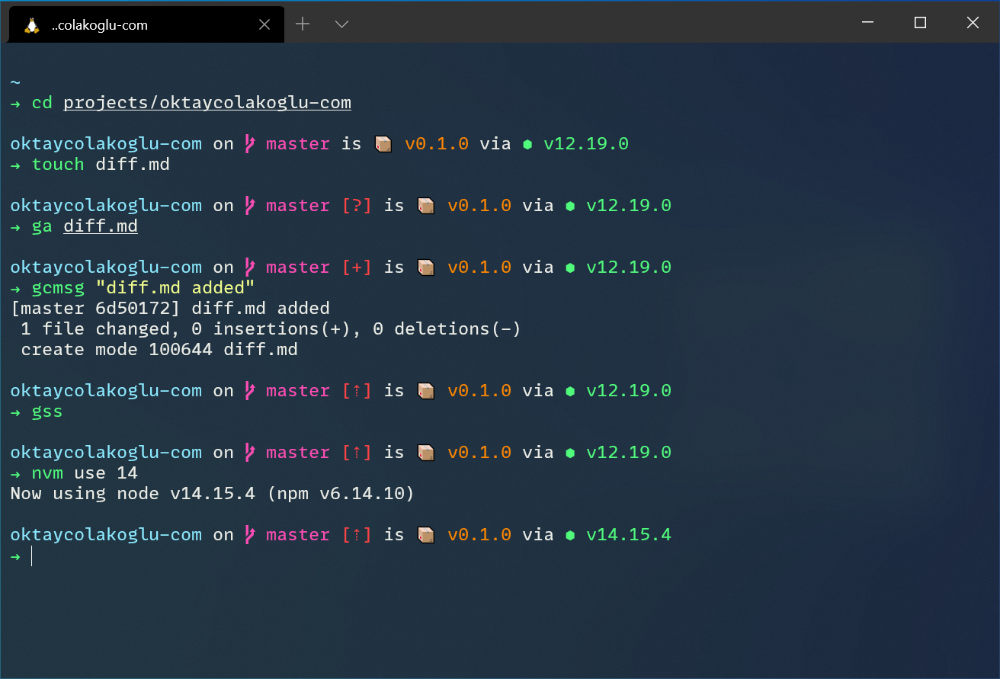

# dotfiles
This is my basic shell and git configuration


*[microsoft/terminal](https://github.com/microsoft/terminal) with [Snazzy](https://windowsterminalthemes.dev/?theme=Snazzy) colors and [microsoft/cascadia-code](https://github.com/microsoft/cascadia-code ) font-family using [starship/starship](https://github.com/starship/starship) prompt*

## Requirements
```
git, curl, wget, zsh
```

## Installation
```shell
git clone git@github.com:oktay/dotfiles.git ~/.dotfiles
cd ~/.dotfiles
source install.sh
```

## Includes
- [ohmyzsh/ohmyzsh](https://github.com/ohmyzsh/ohmyzsh)
  - [zsh-users/zsh-syntax-highlighting](https://github.com/zsh-users/zsh-syntax-highlighting/blob/master/INSTALL.md)
  - [zsh-users/zsh-autosuggestions](https://github.com/zsh-users/zsh-autosuggestions)
- [nvm-sh/nvm](https://github.com/nvm-sh/nvm)
- [pyenv/pyenv](https://github.com/pyenv/pyenv)
  - [pyenv/pyenv-virtualenv](https://github.com/pyenv/pyenv-virtualenv.git)
- [starship/starship](https://github.com/starship/starship)

## Inspiration 
- [buymeasoda/dotfiles](https://github.com/buymeasoda/dotfiles/)
- [mathiasbynens/dotfiles](https://github.com/mathiasbynens/dotfiles)